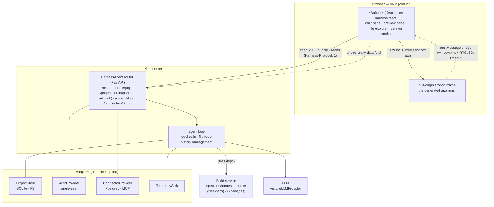

# Architecture

How the pieces talk, what runs where, and why the sandbox is safe to run
AI-written code in. This page is the mental model; the normative details are in
[`spec/`](../spec/) and the interfaces are in [Adapters](./adapters.md).

## The three pieces

Speculos Harness is three deliverables you assemble, each with a working default:

- **The frontend** (`@speculos-harness/react`) — the workspace: a chat panel, a
  live sandboxed preview, a read-only file explorer, and a version timeline. Runs
  in the user's browser, inside your product.
- **The agent kit** (`speculos-harness`, pip) — a FastAPI router you mount. It runs
  the agent loop: it calls the model, executes file tools, and streams the work
  back. This is the production engine behind Speculos, packaged — one loop, in one
  language, on the revenue path.
- **The build service** (`speculos/harness-bundler`) — a locked-down container that
  turns `{files, deps}` into browser-ready `{code, css}`. The agent calls it every
  time a file changes.

Around the agent sit the adapters — storage, the model layer, auth, connectors,
telemetry — each an interface with a default you can replace (see
[Adapters](./adapters.md)).

## How they talk



Reading the diagram:

- The **client talks to the router** over the versioned wire protocol
  (`Harness-Protocol: 1`): a hand-rolled SSE stream for chat, a bundle call, and
  reads for projects and snapshots. Every one of these carries the caller's
  identity, attached by `auth.getHeaders`.
- The **router runs the agent loop**, which calls the model, executes file tools
  server-side, and manages history so long builds stay cheap and coherent.
- When files change, the **loop calls the build service** and the client rebuilds
  the preview.
- The **generated app runs in a null-origin iframe** and cannot fetch anything
  directly. Its only way to reach data is the **postMessage bridge** to the parent,
  which forwards the request to `/connectors/{kind}`, where a connector runs it
  with a server-held credential.

## The edit loop, step by step

1. The user types a request in the chat pane. It is rendered optimistically and
   posted to `POST {base}/chat`.
2. The agent loop assembles the system prompt (with your `instructions` brief and
   any connector prompt lines), takes a pre-turn snapshot, and streams a completion
   from the model.
3. As the model works, the router re-emits its output as
   [seven SSE events](../spec/chat-protocol.md): text deltas, tool-call deltas, a
   finalized tool call, a tool result, and so on. The client renders each as a
   legible step ("Wrote App.tsx").
4. When a file-mutating tool succeeds, the client bumps a rebuild key (the
   `fileSig` contract). The preview pane keys its build on that string, so any file
   change triggers one full rebuild — the agent writes, the build service rebuilds,
   the sandbox refreshes. There is no "run" button and no HMR; a rebuild is a fast
   build-from-scratch.
5. If the app fails to build or crashes at runtime, the preview shows a readable
   fallback (never a blank screen) and the client asks the agent to read the code
   and repair it — exactly **once per rebuild key**, so it can never loop.
6. Every turn is captured as a version. The timeline shows each one; any of the
   last ~30 can be restored, and the restore itself undone.

## What runs where

| Component | Where it runs | Language | Notes |
|---|---|---|---|
| The workspace (`<Builder>`, panes, hooks) | the user's browser | TypeScript / React | inside your product |
| The generated app | a null-origin sandbox iframe | whatever the agent wrote | isolated; no host access |
| The agent router + loop | your server | Python (FastAPI) | mount it or run it standalone |
| The build service | your server (a container) | Bun | `Bun.build` needs Bun |
| Adapters (store, auth, connectors, telemetry) | your server | Python | in-process with the router |
| The model | your provider (or a LiteLLM proxy) | — | any model LiteLLM speaks |

The reference backend is polyglot on purpose: the agent is Python (moved, not
rewritten, from the production engine), and the bundler is Bun because `Bun.build`
runs only under Bun. That is two processes behind one `docker compose up`. The
reasoning, and the browser-only mode that will remove the Bun sidecar for
frontend-only apps, are in the [FAQ](./faq.md).

## The sandbox trust story

The CTO question is "you're running code an AI wrote — where, and what can it
touch?" The design has a deliberate answer, in three parts. The full threat model
is [`spec/security.md`](../spec/security.md); the essentials:

### The generated code is isolated

The app runs in a `srcdoc` iframe with a **null origin** — no access to your page's
cookies, storage, or DOM. The `sandbox` attribute is fixed and load-bearing:

```
allow-scripts allow-forms allow-popups allow-popups-to-escape-sandbox allow-modals allow-top-navigation-by-user-activation
```

**`allow-same-origin` is never added** — it would hand the frame your origin and
defeat the isolation entirely. This is the single most important invariant in the
system, and a startup self-check aborts if the configured sandbox string contains
it. You never hand-write this attribute; it comes from the package.

### The isolation is *why* the bridge exists

Because the frame is null-origin, it cannot fetch anything directly. That is the
mechanism, not a side effect: it forces every data request through the parent
bridge, where your server controls it — checked, scoped to the `Principal`, and
timed out at 60 seconds. An unknown connector degrades to a never-throw stub, so a
missing data source never crashes the preview.

### Credentials never leave the server

A connector holds its own DSN, token, or key; the generated app never sees it. A
data request crosses the bridge, the parent forwards it to `/connectors/{kind}`,
and the connector runs the query with the server-held credential and returns only
the rows. So a Northwind operator's app can query their live arrears database and
render "$1.4M outstanding" while the password never enters the sandbox, the
generated code, or the browser. See [Connectors](./connectors.md).

### The build service is hardened too

The bundler installs and builds real npm packages, so it is an attack surface in
its own right. It ships only as a non-root container with ephemeral build
directories, installs always run with `--ignore-scripts`, and package names and
versions are validated against a strict regex before execution. A startup
self-check refuses to run if `--ignore-scripts` is dropped. See
[`spec/bundle.md`](../spec/bundle.md).

## The protocol is the seam

Every arrow between the client and the server is a versioned, publicly specified
contract carried on a `Harness-Protocol: 1` header. That is what makes the system
safe to embed and extend: a version mismatch fails loudly at the handshake instead
of silently returning a preview with no data, and a third party can implement
either side from the spec alone and interoperate. It is also how the client adapts
to different backends — it asks `GET /capabilities` what a server supports and
adjusts its UI — with no per-server client code. The contract lives in
[`spec/`](../spec/); the types that pin it are in
[`packages/protocol`](../packages/protocol/).
